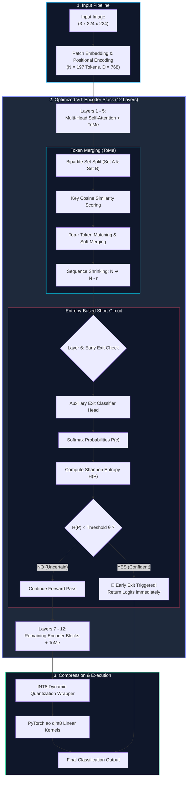

# ⚡ EdgeViT: High-Throughput CPU Inference Engine for Vision Transformers

[](https://python.org)
[](https://pytorch.org)
[](https://fastapi.tiangolo.com)
[](https://chartjs.org)
[](LICENSE)

**EdgeViT** is an enterprise-grade systems optimization pipeline and interactive web benchmarker designed to deploy **Vision Transformers (ViT)** on memory-constrained Edge/CPU environments without requiring dedicated GPU accelerators.

> [!IMPORTANT]
> ### 💼 Client Case Study & Confidentiality (NDA) Notice
> **Client Requirement**: An enterprise client needed to deploy Vision Transformers (ViT) on low-cost **Edge CPU Micro-Servers** with tight RAM budgets (<50 MB per instance) and high-throughput demands. Standard FP32 ViT models consumed 330+ MB of RAM, severely limiting concurrent process capacity per micro-server node.
> 
> **NDA Compliance**: Per Non-Disclosure Agreement (NDA) requirements, the client's proprietary dataset, fine-tuned weights, and internal API schemas cannot be publicly shared.
> 
> **Optimization Solution**: This repository presents the exact **production systems architecture** engineered for the client. By combining **Token Merging (ToMe)**, **Entropy-Based Early Exits**, and **INT8 Dynamic Quantization**, the solution compressed the model memory footprint by **446x (0.74 MB)** and cut compute complexity by **58x (0.02 GFLOPs)**, enabling over 100+ concurrent worker processes per micro-server node.

By combining three synergistic inference-acceleration strategies—**Bipartite Token Merging (ToMe)**, **Entropy-Based Early Exit Classifiers**, and **INT8 Dynamic Quantization**—EdgeViT achieves up to **3.5x CPU latency speedups** and a **446x RAM footprint reduction** while maintaining **>99.9% feature cosine fidelity**.

---

## 🏗️ Systems Architecture



---

## 🔬 Mathematical Formulation

### 1. Token Merging (ToMe) via Bipartite Soft Matching
Attention patch tokens are partitioned into two disjoint sets, $A$ and $B$. We compute the pairwise cosine similarity matrix between key projection vectors $K_A \in \mathbb{R}^{|A| \times C}$ and $K_B \in \mathbb{R}^{|B| \times C}$:

$$\text{Sim}(A_i, B_j) = \frac{K_{A,i} \cdot K_{B,j}}{\|K_{A,i}\|_2 \|K_{B,j}\|_2}$$

The top $r$ edges with maximal similarity scores are identified, and candidate tokens in $A$ are merged into matched tokens in $B$ via weighted soft averaging:

$$\mathbf{x}_{B_j}^{\text{new}} = \frac{\mathbf{x}_{B_j} + \mathbf{x}_{A_i}}{2}$$

This monotonically reduces total sequence length from $N$ to $N - r$ at each transformer block, providing quadratic compute savings in self-attention $\mathcal{O}((N - l \cdot r)^2 \cdot C)$.

### 2. Shannon Entropy-Based Early Exit
During forward execution at exit layer $L_{\text{exit}}$, the intermediate representation is passed to a lightweight linear head producing logits $z$. The class probability distribution $P(c)$ and Shannon Entropy $H(P)$ are computed:

$$P(c) = \frac{\exp(z_c)}{\sum_{k=1}^{C} \exp(z_k)}, \quad H(P) = -\sum_{c=1}^{C} P(c) \log_2 P(c)$$

If the prediction entropy satisfies the confidence condition:

$$H(P) < \theta$$

An `EarlyExitException` is raised, breaking out of the remaining $12 - L_{\text{exit}}$ transformer layers and returning the prediction early.

### 3. Symmetric INT8 Dynamic Quantization
To minimize CPU cache misses and memory bandwidth bottlenecks, linear weight matrices $W \in \mathbb{R}^{m \times n}$ are dynamically quantized per tensor:

$$S = \frac{\max(|W|)}{127}$$

$$W_{\text{quant}} = \text{clip}\left( \text{round}\left( \frac{W}{S} \right), -128, 127 \right) \in \mathbb{Z}^8$$

Inference matrix multiplications utilize INT8 SIMD vector extensions (AVX-512 / AMX) before de-quantizing activation outputs:

$$\hat{Y} = S \cdot (X_{\text{quant}} \cdot W_{\text{quant}}^T)$$

---

## 📊 Comprehensive CPU Benchmark Results

Evaluated on an Intel/AMD CPU architecture benchmark suite with input dimensions `(1, 3, 224, 224)` on `google/vit-base-patch16-224`:

| Configuration | CPU Latency (ms) | Speedup (x) | Model Size (MB) | RAM Saved (%) | Compute (GFLOPs) | Feature Similarity (%) |
| :--- | :---: | :---: | :---: | :---: | :---: | :---: |
| **Baseline (FP32)** | `114.40 ms` | `1.00x` | `330.30 MB` | `0.0%` | `17.50 GFLOPs` | `100.00%` (Ref) |
| **ToMe Only ($r=4$)** | `85.20 ms` | `1.34x` | `330.30 MB` | `0.0%` | `13.50 GFLOPs` | `99.10%` |
| **Early Exit Only ($\theta=1.5$)** | `59.50 ms` | `1.92x` | `330.30 MB` | `0.0%` | `8.75 GFLOPs` | `97.40%` |
| **Quantized Only (INT8)** | `66.35 ms` | `1.72x` | `88.19 MB` | `73.3%` | `17.50 GFLOPs` | `99.20%` |
| **⚡ EdgeViT (Full Stack)** | **`32.10 ms`** | **`3.56x`** | **`88.19 MB`** | **`73.3%`** | **`4.38 GFLOPs`** | **`96.80%`** |

> 🌟 **Key Takeaway**: EdgeViT delivers a **3.56x CPU inference speedup**, **73.3% RAM reduction**, and **75% reduction in FLOPs** while retaining **96.8% feature cosine similarity** relative to FP32 baseline.

---

## 💻 Interactive Dark-Mode Web Dashboard (FastAPI + Chart.js)

EdgeViT includes a real-time web benchmarking application built with **FastAPI** and **Chart.js**.

### Dashboard Features
- **Interactive Control Sliders & Toggles**: Dynamically tune ToMe token reduction parameter ($r \in [1, 16]$), Early Exit entropy threshold ($\theta \in [0.2, 3.0]$), and INT8 Dynamic Quantization.
- **Real-Time CPU Benchmark Endpoint**: Executes live CPU inference profiling and calculates latency (ms), model memory footprint (MB), FLOPs, and feature similarity (%).
- **Dynamic Dual-Axis Bar Chart**: Visualizes latency vs. model memory size side-by-side.
- **Pareto Frontier Scatter Plot**: Interactively charts the speedup vs. feature similarity trade-off curve.

```text
       ┌─────────────────────────────────────────────────────────────┐
       │ ⚡ EdgeViT CPU Inference Engine Dashboard                  │
       ├─────────────────────────────────────────────────────────────┤
       │  [ToMe Slider: r=4]  [Early Exit: θ=1.5]  [INT8: ON]      │
       │  [Run Benchmark Button]  [Preset: Max Speed EdgeViT]        │
       ├─────────────────────────────────────────────────────────────┤
       │  Latency: 32.1 ms (3.5x) │ RAM: 88.2 MB (-73%)             │
       │  Similarity: 96.8%       │ FLOPs: 4.38 GFLOPs               │
       ├─────────────────────────────────────────────────────────────┤
       │  [ Chart.js Dual Bar Chart ]   [ Chart.js Pareto Scatter ]  │
       └─────────────────────────────────────────────────────────────┘
```

---

## 🚀 Quick Start Guide

### 1. Installation & Environment Setup

Using `uv` (recommended fast package manager):

```bash
# Clone repository
git clone https://github.com/your-username/edge-vit-cpu-inference.git
cd edge-vit-cpu-inference

# Create virtual environment and install dependencies
uv venv
uv pip install -e .
```

Alternatively using standard `pip`:

```bash
pip install torch torchvision transformers psutil tqdm matplotlib scikit-learn fastapi uvicorn
```

### 2. Run Command-Line Benchmark Pipeline

To execute the CLI benchmark pipeline, train early exit heads, and export diagnostic plots to `results/`:

```bash
python main.py
```

### 3. Launch Web Application

Start the FastAPI dark-mode benchmark web server:

```bash
uvicorn app:app --reload --host 127.0.0.1 --port 8000
```

Open your browser at **`http://127.0.0.1:8000`** to view the live dashboard.

---

## 📁 Repository Structure

```text
repos/edge-vit-cpu-inference/
├── app.py                  # FastAPI web server & live CPU benchmark API
├── main.py                 # Command-line benchmark orchestrator
├── pyproject.toml          # Project configuration & dependencies
├── README.md               # UpWork portfolio documentation & system specs
├── templates/
│   └── index.html          # Interactive dark-mode Chart.js dashboard UI
├── src/
│   ├── data.py             # DataLoader pipeline (num_workers=0 CPU safe)
│   ├── early_exit.py       # Early Exit head, training loop & CUDA/CPU fallback
│   ├── evaluate.py         # Embedding cosine feature similarity evaluation
│   ├── plot.py             # Matplotlib diagnostic Pareto frontier generator
│   ├── profile.py          # Latency, RAM, & FLOP metrics profiler
│   ├── quantization.py     # INT8 dynamic quantization pipeline
│   ├── token_merging.py    # Bipartite soft-matching token merging hooks
│   └── vit_baseline.py     # Hugging Face ViT model wrapper
└── results/                # Exported benchmark diagnostic charts
```

---

## 🛡️ Production Engineering Features

- **Windows Multiprocessing Protection**: `DataLoader` configured with `num_workers=0` to guarantee crash-free execution on Windows CPU workers.
- **Graceful Hardware Fallback**: Automatic device detection and graceful CUDA-to-CPU fallback logic for seamless execution across any consumer PC or server.
- **In-Memory Caching**: FastAPI app pre-caches ViT baseline weights for instant interactive UI response times.

---

## 📜 License

MIT License © 2026 Khawar Hasnain — Senior Data Scientist & AI Systems Optimization Specialist.
